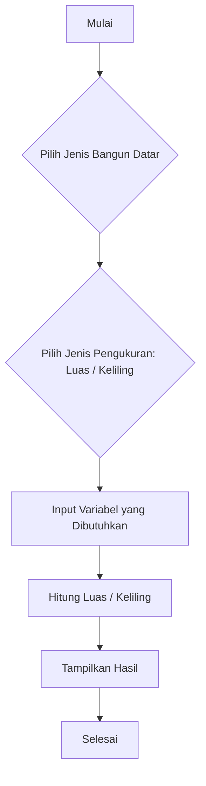

# Katik - Kalkulator Matematika

**Katik** adalah program kalkulator matematika sederhana berbasis bahasa C yang dapat menghitung **luas** dan **keliling** dari berbagai **bangun datar**. Program ini dibuat untuk mempermudah perhitungan geometri dasar dan sekaligus sebagai latihan pemrograman dasar dalam bahasa C.

## Fitur Program
- Menampilkan daftar bangun datar:
  - Persegi
  - Persegi Panjang
  - Segitiga
  - Jajar Genjang
  - Trapesium
  - Layang-layang
  - Belah Ketupat
  - Lingkaran
- Memilih jenis pengukuran: **Luas** atau **Keliling**
- Input nilai variabel satu per satu
- Menampilkan rumus yang digunakan
- Hasil dihitung dan ditampilkan dengan dua angka di belakang koma

## Flowchart Program



## Contoh Tampilan
```
=== KATIK - Kalkulator Matematika ===
1. Persegi
2. Persegi Panjang
...
Pilih jenis bangun datar (1-8): 1

1. Luas Persegi
2. Keliling Persegi
Pilih jenis pengukuran (1 atau 2): 1
Masukkan sisi: 4
Rumus: sisi x sisi
Luas persegi = 16.00
```

## Sumber Referensi / Contoh
- Website kalkulator online Katik: [https://katik.azurewebsites.net](https://katik.azurewebsites.net)

Program ini dibuat sebagai studi mandiri sekaligus implementasi pemahaman terhadap pemrograman dasar dan struktur kontrol dalam bahasa C.

---

🛠 Dibuat dengan semangat belajar dan logika!