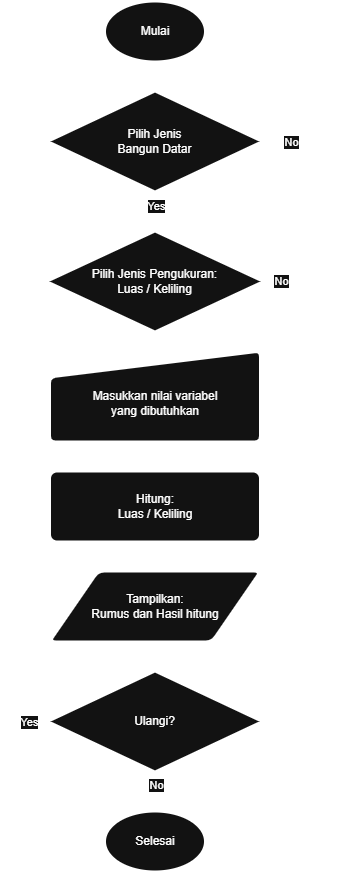

# Katik - Kalkulator Matematika

**Katik** adalah program kalkulator sederhana dalam bahasa C yang digunakan untuk menghitung **luas dan keliling bangun datar**. Program ini menampilkan **rumus** dan **hasil perhitungan** berdasarkan input variabel yang diberikan oleh pengguna, serta dilengkapi fitur validasi input dan opsi perhitungan ulang.

## Fitur Program

- Memilih jenis bangun datar:
  - Persegi
  - Persegi Panjang
  - Segitiga
  - Jajar Genjang
  - Trapesium
  - Layang-Layang
  - Belah Ketupat
  - Lingkaran
- Memilih jenis pengukuran: **Luas** atau **Keliling**
- Input variabel satu per satu
- Menampilkan rumus sebelum hasil hitung
- Validasi input (keluar otomatis jika input tidak sesuai)
- Opsi untuk mengulangi atau mengakhiri program setelah perhitungan selesai

## Alur Program (Flowchart)



## Cara Kerja Program

1. Program dimulai dengan menampilkan daftar bangun datar.
2. Pengguna memilih jenis bangun datar (1-8).
3. Pengguna memilih jenis pengukuran (1 = Luas, 2 = Keliling).
4. Program meminta input variabel yang diperlukan.
5. Program menghitung luas atau keliling sesuai pilihan.
6. Program menampilkan rumus dan hasil perhitungan.
7. Program menawarkan opsi untuk melakukan perhitungan baru atau keluar.

Jika terjadi input yang tidak valid (misal: pilihan bangun salah, pilihan luas/keliling salah, variabel <= 0, atau input pengulangan salah), program akan langsung keluar dengan pesan yang sesuai.

## Contoh Tampilan Program

```
=== KATIK - Kalkulator Matematika ===

Pilih Bangun Datar:
1. Persegi
2. Persegi Panjang
3. Segitiga
4. Jajar Genjang
5. Trapesium
6. Layang-Layang
7. Belah Ketupat
8. Lingkaran

Pilih jenis bangun datar (1-8): 1

1. Luas Persegi
2. Keliling Persegi
Pilih jenis pengukuran (1 atau 2): 1
Masukkan sisi: 5
Rumus: sisi x sisi
Luas persegi = 25.00

Ingin menghitung lagi? (y/n): n

Terima kasih telah menggunakan KATIK!
```

## Sumber Referensi

- Inspirasi format kalkulator dari: [https://katik.azurewebsites.net](https://katik.azurewebsites.net)

---

🛠️ Program ini dikembangkan dengan penuh semangat belajar untuk mendalami konsep struktur kontrol dalam bahasa C.

